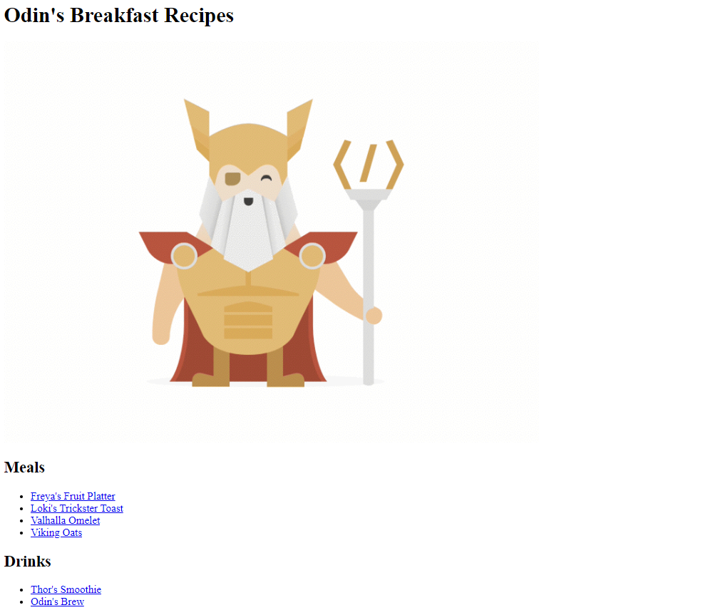
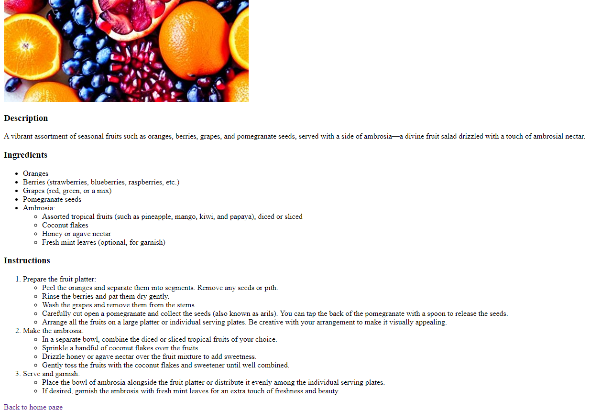

# Odin Recipes

Welcome to the Odin Project's Recipes! This project is designed to test and showcase all of my HTML knowledge so far, without using any CSS. The project contains a collection of breakfast recipes inspired by Norse mythology.

## Project Description

This repository includes a main page listing all the recipes and individual pages for each recipe. Each recipe page contains an image, description, list of ingredients, and detailed instructions for preparation.

## Screenshots

### Home Page

### Recipe Page

